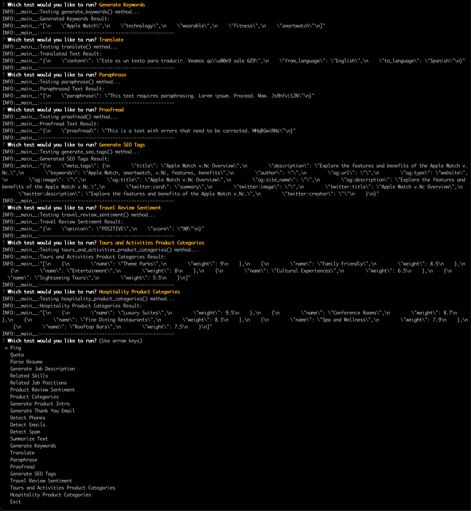

# SharpAPI Python Test Suite / Examples

## 🚀 Overview

Welcome to the **SharpAPI Python Test Suite** repository! This educational project is designed to help Python developers familiarize themselves with **SharpAPI**, an AI-powered API that streamlines workflow automation across various applications. Through a comprehensive set of tests, this repository showcases how to integrate and utilize SharpAPI's capabilities to enhance your projects.

## 📚 Table of Contents

- [Features](#features)
- [Prerequisites](#prerequisites)
- [Installation](#installation)
- [Configuration](#configuration)
- [Usage](#usage)
- [Available Tests](#available-tests)
- [Project Structure](#project-structure)
- [Contributing](#contributing)
- [License](#license)
- [Contact](#contact)

## 🌟 Features

- **Interactive Test Selection**: Choose which SharpAPI endpoint to test via a command-line interface.
- **Comprehensive Endpoint Coverage**: Tests cover a wide range of SharpAPI functionalities, including:
  - Ping
  - Quota Information
  - Resume Parsing
  - Job Description Generation
  - Related Skills & Job Positions
  - Sentiment Analysis
  - Product Categorization & Introduction
  - Email Generation
  - Contact Information Detection
  - Spam Detection
  - Text Summarization & Keyword Generation
  - Translation & Paraphrasing
  - Proofreading & SEO Tag Generation
  - Travel & Hospitality Insights
- **Logging**: Detailed logs for each test, making it easy to track results and debug issues.
- **Randomized Data Generation**: Simulate diverse inputs using randomized strings and data.

## 🛠 Prerequisites

Before you begin, ensure you have met the following requirements:

- **Python 3.8 or higher**: Ensure Python is installed on your machine. You can download it from [python.org](https://www.python.org/downloads/).
- **SharpAPI Account**: Sign up at [SharpAPI.com](https://sharpapi.com/) to obtain your API key.
- **Git**: For cloning the repository. Download from [git-scm.com](https://git-scm.com/downloads) if not already installed.

## 📝 Installation

1. **Clone the Repository**

   ```bash
   git clone https://github.com/yourusername/sharpapi-python-test-suite.git
   cd sharpapi-python-test-suite
   ```

2. **Create a Virtual Environment (Optional but Recommended)**

   ```bash
   python -m venv venv
   source venv/bin/activate  # On Windows, use `venv\Scripts\activate`
   ```

3. **Install Dependencies**

   ```bash
   pip install -r requirements.txt
   ```

   *If `requirements.txt` is not provided, install the necessary packages manually:*

   ```bash
   pip install python-dotenv questionary sharpapi
   ```

## 🔧 Configuration

1. **Set Up Environment Variables**

   Create a `.env` file in the root directory of the project and add your SharpAPI API key:

   ```env
   SHARP_API_KEY=your_sharpapi_api_key_here
   ```

2. **Prepare Additional Files**

   - **Resume File**: If you plan to test the `parse_resume` endpoint, ensure you have a sample resume file named `sample_resume.pdf` in the project directory. Alternatively, update the `resume_file_path` variable in the script to point to your resume file.

## 💻 Usage

Run the test suite using the following command:

```bash
python run_sharpapi_tests.py
```

Upon execution, you'll be presented with an interactive menu to select which test you'd like to run.

### Example Interaction

```
? Which test would you like to run?  [Use arrows to move, type to filter]
❯ Ping
  Quota
  Parse Resume
  Generate Job Description
  Related Skills
  Related Job Positions
  Product Review Sentiment
  Product Categories
  Generate Product Intro
  Generate Thank You Email
  Detect Phones
  Detect Emails
  Detect Spam
  Summarize Text
  Generate Keywords
  Translate
  Paraphrase
  Proofread
  Generate SEO Tags
  Travel Review Sentiment
  Tours and Activities Product Categories
  Hospitality Product Categories
  Exit
```

Use the arrow keys to navigate and press **Enter** to select a test. The selected test will execute, and results will be logged to the console.



## ✅ Available Tests

Here's a list of all the available tests you can run:

1. **Ping**: Check the connectivity to SharpAPI.
2. **Quota**: Retrieve your current subscription quota and usage.
3. **Parse Resume**: Parse a resume file and extract structured data.
4. **Generate Job Description**: Create a detailed job description based on parameters.
5. **Related Skills**: Find skills related to a given skill name.
6. **Related Job Positions**: Identify job positions related to a specified role.
7. **Product Review Sentiment**: Analyze the sentiment of a product review.
8. **Product Categories**: Categorize a product into relevant categories.
9. **Generate Product Intro**: Create an engaging introduction for a product.
10. **Generate Thank You Email**: Compose a personalized thank-you email.
11. **Detect Phones**: Extract phone numbers from text.
12. **Detect Emails**: Extract email addresses from text.
13. **Detect Spam**: Identify spam content within text.
14. **Summarize Text**: Generate a summary of a lengthy text.
15. **Generate Keywords**: Produce relevant keywords for given content.
16. **Translate**: Translate text into a specified language.
17. **Paraphrase**: Rephrase text to improve clarity or style.
18. **Proofread**: Correct grammatical errors in text.
19. **Generate SEO Tags**: Create SEO-friendly meta tags based on content.
20. **Travel Review Sentiment**: Analyze the sentiment of travel-related reviews.
21. **Tours and Activities Product Categories**: Categorize tours and activities products.
22. **Hospitality Product Categories**: Categorize hospitality-related products.
23. **Exit**: Terminate the test suite.

## 🗂 Project Structure

```
sharpapi-python-test-suite/
├── .env
├── run_sharpapi_tests.py
├── sample_resume.pdf
├── requirements.txt
├── README.md
└── LICENSE
```

- **.env**: Environment variables configuration file.
- **run_sharpapi_tests.py**: Main script containing all test functions and the interactive menu.
- **sample_resume.pdf**: Sample resume file for testing the `parse_resume` endpoint.
- **requirements.txt**: Lists all Python dependencies.
- **README.md**: Project documentation (this file).
- **LICENSE**: License information.

## 🎉 Getting Started

1. **Clone the Repository**

   ```bash
   git clone https://github.com/yourusername/sharpapi-python-test-suite.git
   cd sharpapi-python-test-suite
   ```

2. **Set Up Virtual Environment and Install Dependencies**

   ```bash
   python -m venv venv
   source venv/bin/activate  # On Windows, use `venv\Scripts\activate`
   pip install -r requirements.txt
   ```

3. **Configure Environment Variables**

   Create a `.env` file and add your SharpAPI API key:

   ```env
   SHARP_API_KEY=your_sharpapi_api_key_here
   ```

4. **Run the Test Suite**

   ```bash
   python run_sharpapi_tests.py
   ```

   Select the desired test from the interactive menu and view the results in the console.

## 🤝 Contributing

Contributions are welcome! If you have suggestions, bug reports, or enhancements, please open an issue or submit a pull request.

1. **Fork the Repository**

2. **Create a New Branch**

   ```bash
   git checkout -b feature/YourFeatureName
   ```

3. **Commit Your Changes**

   ```bash
   git commit -m "Add Your Feature"
   ```

4. **Push to the Branch**

   ```bash
   git push origin feature/YourFeatureName
   ```

5. **Open a Pull Request**

## 📞 Contact

For any questions or support, feel free to reach out:

- **Email**: [contact@sharpapi.com](mailto:contact@sharpapi.com)
- **Website**: [https://SharpAPI.com](https://sharpapi.com/)

---

## Social Media

🚀 For the latest news, tutorials, and case studies, don't forget to follow us on:
- [SharpAPI X (formerly Twitter)](https://x.com/SharpAPI)
- [SharpAPI YouTube](https://www.youtube.com/@SharpAPI)
- [SharpAPI Vimeo](https://vimeo.com/SharpAPI)
- [SharpAPI LinkedIn](https://www.linkedin.com/products/a2z-web-ltd-sharpapicom-automate-with-aipowered-api/)
- [SharpAPI Facebook](https://www.facebook.com/profile.php?id=61554115896974)

---

Happy coding! 🚀
